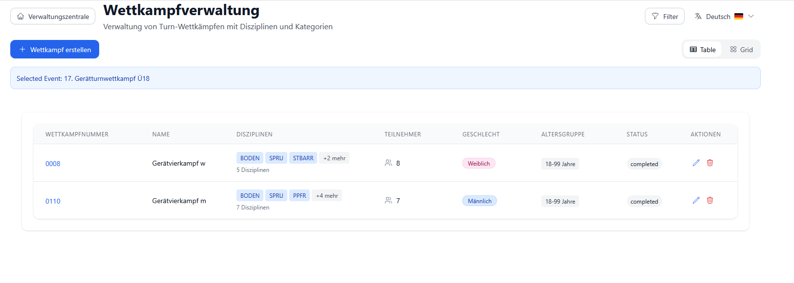
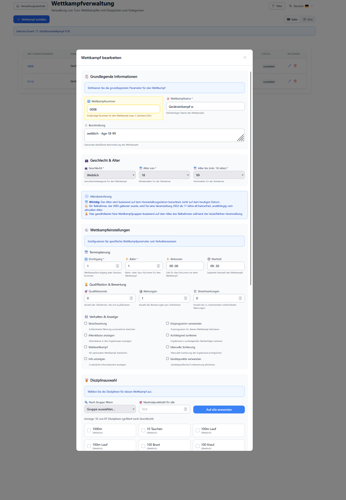
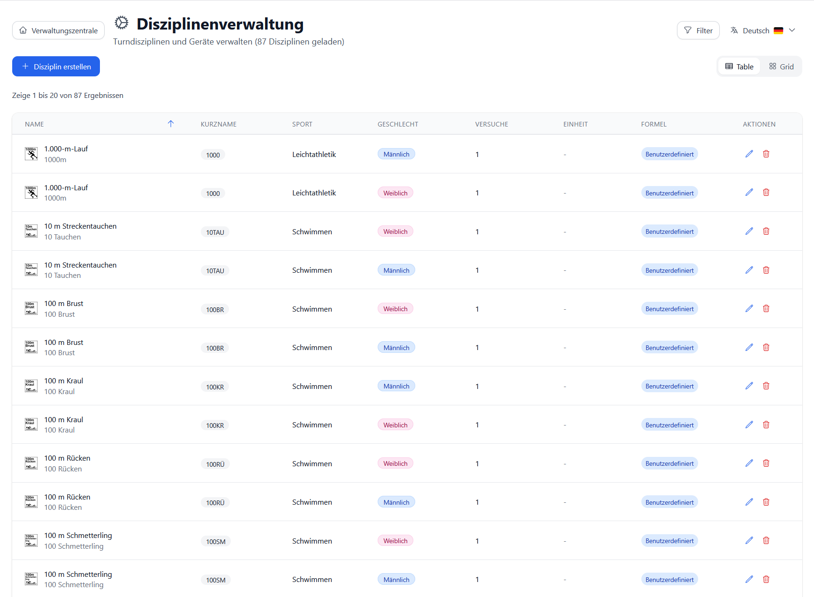

# Wettkämpfe erstellen und verwalten

**Zielgruppe**: Turnverein-Mitarbeiter, Event-Manager, Wettkampfleiter  
**Schwierigkeit**: ⭐⭐ Mittel  
**Zeitaufwand**: 10-15 Minuten pro Wettkampf

---

## 📋 Übersicht

Dieser Guide zeigt Ihnen Schritt für Schritt, wie Sie:
- **Veranstaltungen** (Events) erstellen und konfigurieren
- **Wettkämpfe** innerhalb einer Veranstaltung anlegen
- **Disziplinen** zuweisen und Höchstwertungen festlegen
- **Wettkampfeinstellungen** wie Durchgänge, Startzeiten und Bahnen konfigurieren
- **Teilnehmer** einem Wettkampf zuordnen

---

## 🎯 Was ist der Unterschied zwischen Event und Wettkampf?

| Begriff | Bedeutung | Beispiel |
|---------|-----------|----------|
| **Event (Veranstaltung)** | Übergeordnete Veranstaltung mit Datum, Ort, Organisator | "Landesmeisterschaften Baden-Württemberg 2025" |
| **Wettkampf (Competition)** | Spezifische Alters-/Geschlechtsklasse innerhalb eines Events | "Männlich AK 12-13", "Weiblich AK 14-15" |

**Ein Event kann mehrere Wettkämpfe enthalten.**

---

## ✅ Voraussetzungen

Bevor Sie einen Wettkampf erstellen, stellen Sie sicher, dass:

- ✅ **Stammdaten angelegt sind**:
  - [Regionen](../images/ui-screenshots/Region%20Management.png) (Verbände, Gaue)
  - [Vereine](../images/ui-screenshots/Vereine.png)
  - [Wettkampforte](../images/ui-screenshots/LocationsDebug.png)
  
- ✅ **Disziplinen konfiguriert sind**:
  - Siehe [Disziplinen verwalten](../images/ui-screenshots/Disciplines.png)
  
- ✅ **Teilnehmer/Athleten erfasst sind**:
  - Siehe [Teilnehmer-Verwaltung](./participant-management.md)

---

## 🚀 Schritt 1: Event (Veranstaltung) erstellen

### 1.1 Event-Übersicht öffnen


1. Navigieren Sie im Hauptmenü zu **"Veranstaltungen"**
2. Sie sehen die Liste aller Events mit:
   - **Name der Veranstaltung**
   - **Start- und Enddatum**
   - **Wettkampfort**
   - **Status** (Upcoming/Active/Completed)
   - **Teilnehmerzahl**

### 1.2 Neues Event anlegen

Klicken Sie oben rechts auf **"+ Neue Veranstaltung"**

**Pflichtfelder**:
- **Eventname**: z.B. "Bezirksmeisterschaften 2025"
- **Startdatum**: Erster Tag der Veranstaltung
- **Enddatum**: Letzter Tag der Veranstaltung
- **Wettkampfort**: Wählen Sie aus der Dropdown-Liste (vorher in Stammdaten angelegt)

**Optionale Felder**:
- **Beschreibung**: Zusätzliche Informationen
- **Meldeschluss**: Deadline für Anmeldungen
- **Veranstalter**: Name des organisierenden Vereins
- **Ansprechpartner**: Kontaktperson für Fragen
- **Hinweise**: Wichtige Informationen für Teilnehmer

### 1.3 Event speichern

Klicken Sie auf **"Speichern"** - das Event erscheint nun in der Übersicht.

---

## 🏆 Schritt 2: Wettkampf erstellen

### 2.1 Event auswählen

1. Klicken Sie in der Event-Liste auf das gewünschte Event
2. Sie gelangen zur **Event-Management-Ansicht**



### 2.2 Neuer Wettkampf

Klicken Sie auf **"+ Neuer Wettkampf"**

### 2.3 Wettkampf-Grunddaten



**Tab 1: Grunddaten**

| Feld | Beschreibung | Beispiel |
|------|--------------|----------|
| **Wettkampf-Nr.** | Eindeutige Nummer (optional) | "1a", "2b" |
| **Bezeichnung** | Name des Wettkampfs | "Männlich AK 12-13" |
| **Beschreibung** | Zusätzliche Details | "P-Stufen 5-6" |
| **Geschlecht** | Männlich/Weiblich/Gemischt | Männlich |
| **Alter von** | Untere Altersgrenze | 12 |
| **Alter bis** | Obere Altersgrenze | 13 |

**💡 Tipp**: Die Altersgruppen werden automatisch aus dem Geburtsdatum der Teilnehmer berechnet.

### 2.4 Disziplinen zuweisen

**Tab 2: Disziplinen**

1. Wählen Sie die **Disziplinen** für diesen Wettkampf:
   - Für Männer: Boden, Pferd, Ringe, Sprung, Barren, Reck
   - Für Frauen: Sprung, Stufenbarren, Schwebebalken, Boden
   - Sonderwettbewerbe: Minitrampolin, Gerätebahnen

2. Legen Sie für jede Disziplin die **Höchstwertung** fest:
   - Standard: 10.0 oder 20.0 Punkte
   - **Massenänderung**: Alle Disziplinen gleichzeitig ändern mit dem Feld "Maximalpunktzahl für alle"



**Code-Hintergrund** (für Interessierte):
```typescript
// Die Disziplin-Zuordnung wird im Backend gespeichert in:
// tfx_wettkampfdisziplinen
interface CompetitionDiscipline {
  disciplineId: number;     // Verknüpfung zur Disziplin
  maxScore: number;         // Höchstwertung (z.B. 10.0)
}
```

### 2.5 Wettkampfeinstellungen (Erweitert)

**Tab 3: Einstellungen**

| Einstellung | Bedeutung | Standard |
|-------------|-----------|----------|
| **Durchgang** | Wettkampfrunde/Session | 1 |
| **Bahn** | Start-Bahn-Nummer | 1 |
| **Startzeit** | Beginn des Wettkampfs | 08:30 |
| **Einturnzeit** | Beginn Aufwärmen | 08:00 |
| **Qualifikanten** | Anzahl für Finale | 0 (keins) |
| **Wertungen** | Anzahl Kampfrichter-Wertungen | 3 |
| **Streichwertung** | Schlechteste Note streichen | ☐ Nein |
| **AK anzeigen** | Altersklasse in Ergebnissen zeigen | ☐ Nein |
| **Wahlwettkampf** | Optionale Teilnahme | ☐ Nein |
| **Anz. Streich** | Anzahl zu streichender Disziplinen | 0 |

**💡 Wichtig**: 
- **Durchgang**: Wenn mehrere Wettkämpfe parallel laufen, nummerieren Sie die Durchgänge (1, 2, 3...)
- **Bahn**: Wichtig für die [Zeitplanung](./time-planning.md) und Rotationsplan

**Code-Referenz**:
```typescript
// Diese Felder werden gespeichert in: tfx_wettkampf
const competitionSettings = {
  int_durchgang: 1,        // Durchgang/Runde
  int_bahn: 1,             // Bahn-Nummer
  tim_startzeit: '08:30',  // Startzeit (HH:MM)
  tim_einturnen: '08:00',  // Aufwärmzeit (HH:MM)
  int_wertungen: 3,        // Anzahl Wertungen
  bol_streichwertung: false // Streichwertung ja/nein
}
```

### 2.6 Wettkampf speichern

1. Klicken Sie auf **"Speichern"**
2. Der Wettkampf erscheint in der Wettkampfliste des Events

---

## 👥 Schritt 3: Teilnehmer zuweisen

### 3.1 Teilnehmer-Ansicht öffnen

1. Wählen Sie den Wettkampf in der Liste
2. Klicken Sie auf **"Teilnehmer verwalten"**


### 3.2 Teilnehmer hinzufügen

**Option A: Einzeln hinzufügen**
1. Klicken Sie auf **"+ Teilnehmer hinzufügen"**
2. Wählen Sie Athlet aus der Liste
3. Vergeben Sie eine **Startnummer** (optional, kann auch automatisch generiert werden)
4. Speichern

**Option B: Automatische Startnummern generieren**
1. Gehen Sie zur Event-Management-Ansicht
2. Klicken Sie auf **"Startnummern generieren"**
3. Das System vergibt automatisch aufsteigende Nummern für alle Teilnehmer

**Code-Hintergrund**:
```typescript
// API-Endpunkt für automatische Startnummern-Generierung
PUT /api/events/{eventId}/generate-start-numbers

// Logik im Backend:
// 1. Alle Teilnehmer des Events laden
// 2. Nach Wettkampf und Name sortieren
// 3. Fortlaufende Startnummern vergeben (1, 2, 3, ...)
```


### 3.3 Teilnehmer-Details prüfen

Für jeden Teilnehmer sehen Sie:
- **Name** und **Vorname**
- **Verein** (mit Badge)
- **Geschlecht**
- **Alter** (automatisch berechnet)
- **Startnummer**
- **Status** (aktiv/inaktiv)

---

## 📊 Schritt 4: Wettkampf-Übersicht

### 4.1 Wettkampf-Status

In der Wettkampfliste sehen Sie:

| Spalte | Information |
|--------|-------------|
| **Nr.** | Wettkampf-Nummer |
| **Name** | Wettkampf-Bezeichnung |
| **Geschlecht** | Badge mit Farbe (🔵 Männlich, 🔴 Weiblich, 🟣 Gemischt) |
| **Altersklasse** | "12-13 Jahre" |
| **Disziplinen** | Anzahl der Disziplinen (z.B. "6 Disziplinen") |
| **Teilnehmer** | Anzahl angemeldeter Teilnehmer |
| **Status** | Upcoming/Active/Completed |

### 4.2 Filter und Suche

**Suchfeld**: Name oder Wettkampf-Nummer eingeben

**Filter**:
- **Geschlecht**: Männlich, Weiblich, Gemischt
- **Status**: Upcoming, Active, Completed
- **Altersgruppe**: Nach AK filtern

**Ansichten**:
- 📋 **Tabelle** (Standard): Übersichtliche Liste
- 📱 **Karten**: Kachel-Ansicht mit mehr Details
- 🔲 **Grid**: Kompakte Raster-Ansicht

### 4.3 Aktionen

Für jeden Wettkampf verfügbar:

| Aktion | Symbol | Funktion |
|--------|--------|----------|
| **Bearbeiten** | ✏️ | Wettkampf-Daten ändern |
| **Löschen** | 🗑️ | Wettkampf entfernen (nur wenn keine Wertungen) |
| **Teilnehmer** | 👥 | Teilnehmer-Verwaltung öffnen |
| **Wertungen** | 🏆 | Zur Wertungserfassung wechseln |

---

## ⏰ Schritt 5: Zeitplanung (Optional)

Nach dem Anlegen des Wettkampfs können Sie die Zeitplanung verfeinern:

1. Navigieren Sie zu **"Zeitplanung"** im Hauptmenü
2. Wählen Sie das Event
3. Siehe detaillierten Guide: [Zeitplanung für Wettkämpfe](./time-planning.md)

**Wichtige Konzepte**:
- **Durchgang**: Zeitblock für einen oder mehrere Wettkämpfe
- **Startgerät**: Das Gerät, an dem ein Wettkampf beginnt (z.B. "Boden")
- **Rotation**: Automatischer Wechsel zwischen Disziplinen

---

## 🎯 Tipps & Best Practices

### ✅ Do's

1. **Eindeutige Namen**: Verwenden Sie klare Wettkampf-Bezeichnungen
   - ✅ "Männlich AK 12-13 P-Stufe 5"
   - ❌ "Wettkampf 1"

2. **Durchgänge planen**: Wenn mehrere Wettkämpfe parallel laufen, vergeben Sie unterschiedliche Durchgangs-Nummern

3. **Startnummern prüfen**: Nach automatischer Generierung einmal kontrollieren

4. **Höchstwertungen**: Für alle Disziplinen gleich setzen (z.B. alle 10.0 oder alle 20.0)

5. **Altersgruppen**: Orientieren Sie sich an den offiziellen Wettkampfausschreibungen Ihres Verbandes

### ❌ Don'ts

1. **Wettkampf nicht löschen**, wenn bereits Wertungen erfasst wurden
   - System verhindert dies automatisch
   - Alternative: Wettkampf als "completed" markieren

2. **Keine unrealistischen Altersgruppen** (z.B. "1-99 Jahre")
   - Besser: Mehrere Wettkämpfe für unterschiedliche AKs

3. **Durchgänge nicht durcheinander bringen**
   - Durchgang 1 sollte vor Durchgang 2 starten
   - Nutzen Sie die Zeitplanung für Übersicht

4. **Geschlecht beachten**: Männer können nicht zu Frauen-Wettkämpfen angemeldet werden
   - System warnt automatisch bei Fehler

---

## ❓ Häufige Probleme & Lösungen

### Problem 1: "Teilnehmer wird nicht angezeigt"

**Ursachen**:
- Geschlecht passt nicht (Mann im Frauen-Wettkampf)
- Alter außerhalb der Altersgruppe
- Teilnehmer hat keinen aktiven Status

**Lösung**:
1. Überprüfen Sie Teilnehmer-Daten (Geburtsdatum, Geschlecht)
2. Passen Sie Wettkampf-Altersgruppen an
3. Aktivieren Sie den Teilnehmer in der Teilnehmer-Verwaltung

### Problem 2: "Disziplin fehlt in Auswahl"

**Ursache**: Disziplin nicht für Geschlecht freigegeben

**Lösung**:
1. Gehen Sie zu **"Disziplinen"** in Stammdaten
2. Bearbeiten Sie die Disziplin
3. Aktivieren Sie "Männlich erlaubt" oder "Weiblich erlaubt"


### Problem 3: "Wettkampf kann nicht gelöscht werden"

**Ursache**: Wettkampf hat bereits Wertungen oder Teilnehmer

**Lösung**:
1. **Option A**: Löschen Sie zuerst alle Wertungen (Achtung: Datenverlust!)
2. **Option B**: Markieren Sie Wettkampf als "abgeschlossen" statt zu löschen

### Problem 4: "Startnummern durcheinander"

**Ursache**: Manuell vergebene Nummern oder mehrfache Generierung

**Lösung**:
1. Klicken Sie auf **"Startnummern neu generieren"**
2. System überschreibt alle Nummern
3. Prüfen Sie die Reihenfolge in der Teilnehmer-Liste

---

## 🔄 Daten aus GymNet importieren

Wenn Sie bereits Wettkämpfe in **GymNet** angelegt haben:

1. Exportieren Sie die XML-Datei aus GymNet
2. Gehen Sie zu **"Events"** → **"Importieren"**
3. Wählen Sie die XML-Datei
4. System importiert automatisch:
   - Event-Daten
   - Wettkämpfe mit Disziplinen
   - Teilnehmer mit Startnummern
   - Vereine und Regionen

**Siehe detaillierter Guide**: [GymNet Import](../developer-guide/features/gymnet-import.md)

**Mapping-Tabelle** (automatisch):

| GymNet | TurnFix |
|--------|---------|
| `waBezeichnung` | Wettkampf-Name |
| `waGeschlecht=1` | Männlich |
| `waGeschlecht=2` | Weiblich |
| `waAlterVon` | Alter von |
| `waAlterBis` | Alter bis |
| `<Discipline gymnetid="200">` | Boden (ID 74) |

---

## 📈 Nächste Schritte

Nach dem Erstellen des Wettkampfs:

1. **[Zeitplanung konfigurieren](./time-planning.md)**
   - Durchgänge anlegen
   - Startgeräte zuweisen
   - Rotation planen

2. **[Wertungserfassung vorbereiten](./score-capture.md)**
   - Kampfrichter-Zugänge erstellen
   - Geräte-Zuordnung prüfen
   - Test-Wertungen durchführen

3. **[Urkunden vorbereiten](./certificate-creation.md)**
   - Layout auswählen
   - Vorlagen anpassen
   - Test-Druck durchführen

4. **[Ergebnisse veröffentlichen](./results-export.md)**
   - Live-Ergebnisse aktivieren
   - Export-Formate wählen
   - Medaillenspiegel erstellen

---

## 🔗 Verwandte Dokumentation

### Benutzer-Guides
- [Teilnehmer verwalten](./participant-management.md)
- [Zeitplanung](./time-planning.md)
- [Wertungserfassung](./score-capture.md)
- [Urkunden erstellen](./certificate-creation.md)

### Developer-Guides
- [Event Management API](../developer-guide/architecture/event-management-api.md)
- [Competition Data Model](../developer-guide/architecture/database-schema.md)
- [GymNet Import Implementation](../developer-guide/features/gymnet-import.md)

### Stammdaten
- [Disziplinen verwalten](../reference/disciplines.md)
- [Vereine anlegen](../reference/clubs.md)
- [Wettkampforte konfigurieren](../reference/venues.md)

---

## 📞 Support

**Probleme oder Fragen?**

1. **Dokumentation durchsuchen**: [TurnFix Docs](../README.md)
2. **GitHub Issues**: [github.com/Igel18/turnfix/issues](https://github.com/Igel18/turnfix/issues)
3. **Community**: TurnFix Discord/Forum (falls vorhanden)

---

**Version**: 2.0  
**Letzte Aktualisierung**: 05.11.2025  
**Autor**: TurnFix Team  
**Feedback**: Gerne als GitHub Issue einreichen!
