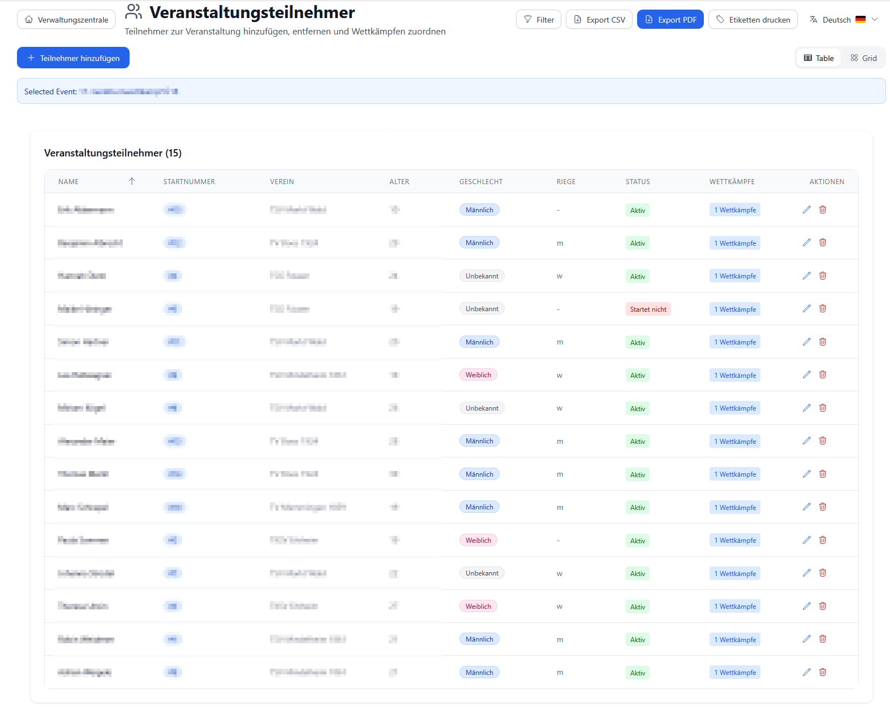
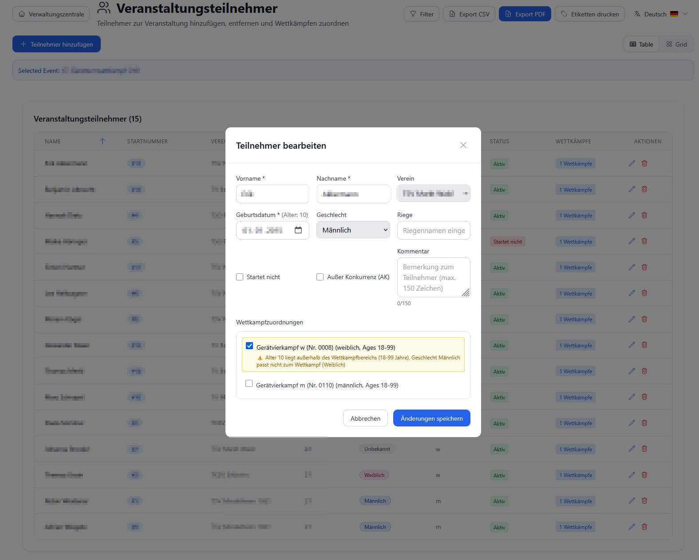
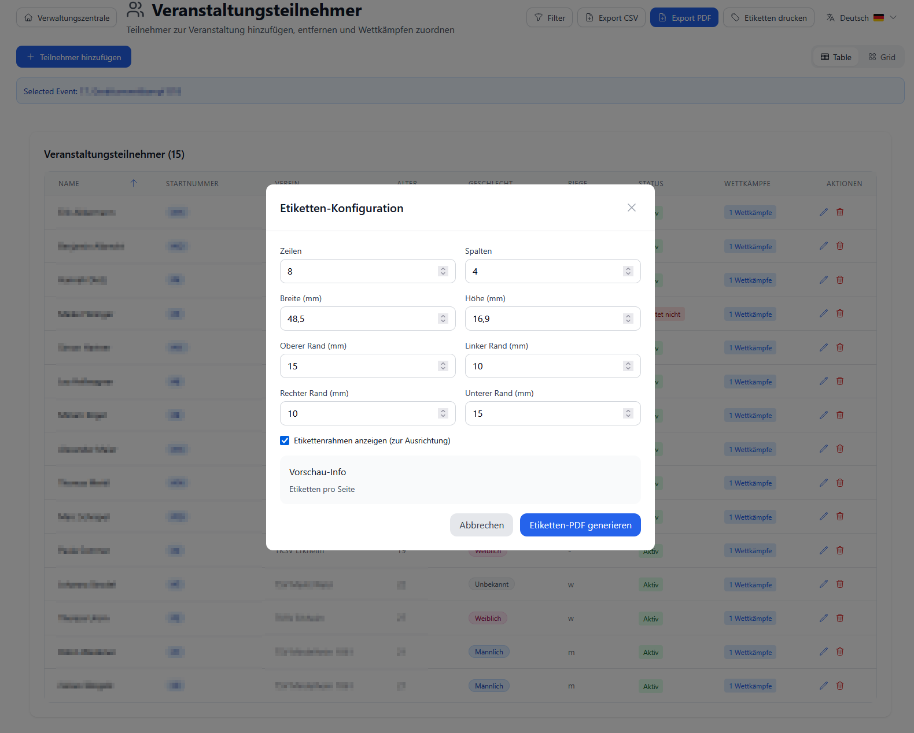

# Teilnehmer verwalten

**Zielgruppe**: Event-Manager, Wettkampfleiter, Vereins-Administratoren  
**Schwierigkeit**: ⭐ Einfach  
**Zeitaufwand**: 2-5 Minuten pro Teilnehmer, Massen-Import: 5 Minuten

---

## 📋 Übersicht

Die **Teilnehmer-Verwaltung** ist das Herzstück der Wettkampf-Organisation. Hier verwalten Sie:

- ✅ **Athleten erfassen** - Persönliche Daten, Verein, Geburtsdatum
- ✅ **Startnummern vergeben** - Automatisch oder manuell
- ✅ **Wettkämpfen zuordnen** - Teilnehmer zu Wettkämpfen hinzufügen
- ✅ **Labels drucken** - Startnummern-Aufkleber
- ✅ **Massen-Import** - GymNet XML oder CSV
- ✅ **Daten exportieren** - CSV für weitere Verarbeitung

**Wichtig**: 
- **Athleten** = Personen-Stammdaten (wiederverwendbar)
- **Teilnehmer** = Athleten + Wettkampf-Zuordnung + Startnummer

---

## 🎯 Kernkonzepte

### 1. Athlet vs. Teilnehmer

**Athlet (Person)**:
- **Stammdaten**: Name, Geburtsdatum, Geschlecht, Verein
- **Wiederverwendbar**: Kann an mehreren Events teilnehmen
- **Langfristig**: Bleibt in Datenbank gespeichert

**Teilnehmer (Event-spezifisch)**:
- **Athlet + Event**: Verknüpfung Athlet ↔ Wettkampf
- **Startnummer**: Nur für diesen Wettkampf gültig
- **Temporär**: Nur für aktuelles Event relevant

**Beispiel**:
```
Athlet "Max Müller" (TV Musterhausen, *2012)
├─ Teilnehmer Bezirksmeisterschaften 2025 (Startnr. 15)
├─ Teilnehmer Landesmeisterschaften 2025 (Startnr. 42)
└─ Teilnehmer Vereinsmeisterschaften 2025 (Startnr. 3)
```

### 2. Altersberechnung

**Automatisch berechnet** aus Geburtsdatum:
- **Wettkampfjahr**: Jahr des Events
- **Stichtag**: Meist 31.12. des Wettkampfjahres (konfigurierbar)

**Beispiel**:
```
Geburtsdatum: 15.06.2012
Wettkampf: 05.11.2025
→ Alter: 13 Jahre (2025 - 2012)
→ Altersklasse: AK 12-13 ✓
```

**Code-Hintergrund**:
```typescript
// Altersberechnung
const calculateAge = (birthdate: string, competitionDate: string): number => {
  const birth = new Date(birthdate);
  const competition = new Date(competitionDate);
  let age = competition.getFullYear() - birth.getFullYear();
  
  // Korrektur falls Geburtstag im Wettkampfjahr noch nicht war
  const monthDiff = competition.getMonth() - birth.getMonth();
  if (monthDiff < 0 || (monthDiff === 0 && competition.getDate() < birth.getDate())) {
    age--;
  }
  
  return age;
};
```

### 3. Geschlecht-System

**Drei Werte** (für Wettkampf-Zuordnung):

| Wert | Datenbank | Anzeige | Farbe |
|------|-----------|---------|-------|
| **1** | `int_geschlecht = 1` | 🔵 Männlich | Blau |
| **2** | `int_geschlecht = 2` | 🔴 Weiblich | Rosa |
| **3** | `int_geschlecht = 3` | 🟣 Divers | Lila |

**Automatische Validierung**:
- System prüft bei Wettkampf-Zuordnung
- Männlich → nur Männer-Wettkämpfe
- Weiblich → nur Frauen-Wettkämpfe
- Gemischte Wettkämpfe → alle Geschlechter

### 4. Startnummern-System

**Zwei Varianten**:

**A) Automatische Generierung** (empfohlen):
- System vergibt fortlaufende Nummern
- Sortierung nach: Wettkampf, Geschlecht, Name
- Beispiel: 1, 2, 3, 4, ...

**B) Manuelle Vergabe**:
- Sie tragen Startnummer ein
- Flexibel für spezielle Fälle
- Duplikate werden geprüft

**Code-Referenz**:
```typescript
// Automatische Startnummern-Generierung (API)
PUT /api/events/{eventId}/generate-start-numbers

// Logik:
// 1. Alle Teilnehmer des Events laden
// 2. Sortieren nach: Wettkampf, Geschlecht, Nachname
// 3. Fortlaufende Nummern vergeben (1, 2, 3, ...)
// 4. In Datenbank schreiben (tfx_teilnehmer.int_startpassnummer)
```

---

## ✅ Voraussetzungen

1. ✅ **Stammdaten angelegt**:
   - [Vereine](../images/ui-screenshots/Vereine.png)
   - [Regionen/Verbände](../images/ui-screenshots/Region%20Management.png)

2. ✅ **Event erstellt** - Siehe [Wettkämpfe verwalten](./event-competition-management.md)

3. ✅ **Wettkämpfe angelegt** - Mit Altersgruppen und Geschlecht

**Optional**:
- 📄 **Excel-Liste** mit Athleten (für Massen-Import)
- 🏷️ **Etiketten-Drucker** (für Startnummern-Labels)

---

## 🚀 Schritt 1: Teilnehmer-Übersicht

### 1.1 Übersicht öffnen



**Navigation**: Hauptmenü → **"Teilnehmer"**

**Übersicht zeigt**:
- Alle Teilnehmer aller Events
- **Smart Pagination**: Automatisches Laden bei Scrollen
- **Filter**: Verein, Geschlecht, Alter
- **Suche**: Name, Startnummer

### 1.2 Ansichten

**Drei Ansicht-Modi**:

| Modus | Symbol | Verwendung |
|-------|--------|------------|
| **Tabelle** | 📋 | Standard, alle Details auf einen Blick |
| **Karten** | 🎴 | Übersichtlich mit Foto-Platzhaltern |
| **Grid** | 🔲 | Kompakte Kachel-Ansicht |

**Umschalten**: Buttons oben rechts

### 1.3 Tabellen-Spalten

| Spalte | Inhalt | Sortierbar |
|--------|--------|------------|
| **Startnr.** | Startnummer | ✅ |
| **Name** | Nachname, Vorname | ✅ |
| **Verein** | Vereins-Name (Badge) | ✅ |
| **Geschlecht** | 🔵 M / 🔴 W | ✅ |
| **Alter** | Berechnetes Alter | ✅ |
| **Geburtsdatum** | Datum (optional ausgeblendet) | ✅ |
| **Aktionen** | Bearbeiten, Löschen | ❌ |

**💡 Tipp**: Klicken Sie auf Spalten-Überschrift zum Sortieren

---

## 👤 Schritt 2: Teilnehmer hinzufügen

### 2.1 Neuen Teilnehmer erstellen

**Button**: **"+ Neuer Teilnehmer"** (oben rechts)



**Formular öffnet sich**

### 2.2 Pflichtfelder ausfüllen

| Feld | Beschreibung | Beispiel | Pflicht |
|------|--------------|----------|---------|
| **Nachname** | Familienname | Müller | ✅ |
| **Vorname** | Rufname | Max | ✅ |
| **Geburtsdatum** | Datum (TT.MM.JJJJ) | 15.06.2012 | ✅ |
| **Geschlecht** | Männlich/Weiblich/Divers | Männlich | ✅ |
| **Verein** | Dropdown-Auswahl | TV Musterhausen | ✅ |
| **Startnummer** | Manuell oder leer (später generieren) | 15 | ❌ |

**Geschlecht-Auswahl**:
- ⚪ Männlich
- ⚪ Weiblich
- ⚪ Divers

**Verein-Auswahl**:
- Dropdown mit allen Vereinen
- Falls Verein fehlt: [Verein anlegen](../reference/clubs.md)

### 2.3 Startnummer

**Option A: Leer lassen** (empfohlen)
- Später automatisch generieren
- System vergibt fortlaufend

**Option B: Manuell eingeben**
- Zahl zwischen 1-9999
- System prüft auf Duplikate
- Warnung bei Überschneidung

**💡 Tipp**: Startnummern erst generieren wenn alle Teilnehmer erfasst sind

### 2.4 Speichern

**Button**: **"Speichern"**

**System**:
1. Validiert Eingaben
2. Berechnet Alter
3. Speichert in Datenbank
4. Aktualisiert Liste

**Fehler-Meldungen**:
- ❌ "Nachname erforderlich"
- ❌ "Geburtsdatum ungültig"
- ❌ "Startnummer bereits vergeben"

---

## 📝 Schritt 3: Teilnehmer bearbeiten

### 3.1 Teilnehmer auswählen

**Klicken Sie auf**: **Bearbeiten-Symbol** (✏️) in der Zeile

**Formular öffnet sich** mit vorausgefüllten Daten

### 3.2 Daten ändern

**Änderbar**:
- ✅ Name (Nachname, Vorname)
- ✅ Geburtsdatum
- ✅ Geschlecht (Achtung: Wettkampf-Zuordnung prüfen!)
- ✅ Verein
- ✅ Startnummer

**Nicht änderbar**:
- ❌ Teilnehmer-ID (interne Nummer)

### 3.3 Geschlecht ändern - Warnung!

**Problem**: Wettkampf-Zuordnung kann ungültig werden

**Beispiel**:
```
Teilnehmer: Max Müller (Männlich)
Zugeordnet zu: "Männlich AK 12-13"

Änderung auf: Weiblich
→ Wettkampf-Zuordnung ungültig!
→ Teilnehmer wird aus Wettkampf entfernt (automatisch)
```

**Lösung**:
1. Prüfen Sie vor Änderung: Hat Teilnehmer Wettkämpfe?
2. Nach Änderung: Neu zu passenden Wettkämpfen zuordnen

### 3.4 Speichern

**Button**: **"Speichern"**

System aktualisiert:
- Teilnehmer-Daten
- Alter (neu berechnet)
- Wettkampf-Zuordnungen (Validierung)

---

## 🗑️ Schritt 4: Teilnehmer löschen

### 4.1 Löschen-Button

**Klicken Sie auf**: **Löschen-Symbol** (🗑️)

**Bestätigungs-Dialog**:
```
Möchten Sie diesen Teilnehmer wirklich löschen?

Teilnehmer: Max Müller (TV Musterhausen)
Startnummer: 15

Diese Aktion kann nicht rückgängig gemacht werden.

[Abbrechen]  [Löschen]
```

### 4.2 Was wird gelöscht?

**Entfernt**:
- ✅ Teilnehmer-Datensatz
- ✅ Wettkampf-Zuordnungen
- ✅ Startnummer

**Behalten**:
- ✅ Athlet-Stammdaten (falls Option "Athlet behalten" aktiviert)
- ✅ Wertungen (als "gelöschter Teilnehmer" markiert)

**💡 Hinweis**: Wertungen bleiben für Archiv-Zwecke erhalten

### 4.3 Vorsicht!

**Nicht löschen wenn**:
- ❌ Wettkampf bereits gestartet
- ❌ Wertungen vorhanden
- ❌ Urkunden gedruckt

**Besser**: Teilnehmer als "inaktiv" markieren (zukünftiges Feature)

---

## 🔢 Schritt 5: Startnummern generieren

### 5.1 Event Management öffnen

**Navigation**: 
1. **Events** → Ihr Event auswählen
2. **Event Management** öffnen

### 5.2 Startnummern generieren

**Button**: **"Startnummern generieren"** (im Header)

**System-Workflow**:
1. Lädt alle Teilnehmer des Events
2. Sortiert nach:
   - Wettkampf (alphabetisch)
   - Geschlecht (männlich vor weiblich)
   - Nachname (A-Z)
3. Vergibt fortlaufende Nummern (1, 2, 3, ...)
4. Speichert in Datenbank

**Bestätigungs-Dialog**:
```
Startnummern für 87 Teilnehmer generieren?

Bestehende Startnummern werden überschrieben!

[Abbrechen]  [Generieren]
```

**Ergebnis**:
```
✅ 87 Startnummern erfolgreich vergeben
   Bereich: 1 - 87
```

**💡 Tipp**: Generieren Sie neu, wenn Sie Teilnehmer nachgetragen haben

---

## 🏷️ Schritt 6: Startnummern-Labels drucken

### 6.1 Label-Ansicht öffnen



**Tab**: **"Labels"** (in Teilnehmer-Übersicht)

### 6.2 Layout wählen

**Vorlagen**:
- **Avery 5160** (30 Labels pro Seite, 2.5x1 inch)
- **Avery L7160** (21 Labels pro Seite, 63.5x38.1 mm)
- **Herma 4453** (40 Labels pro Seite)
- **Benutzerdefiniert** (eigene Maße eingeben)

### 6.3 Inhalt konfigurieren

**Felder pro Label**:
- ☑️ **Startnummer** (groß, fett)
- ☑️ **Name** (Teilnehmer)
- ☑️ **Verein** (klein)
- ☑️ **Wettkampf** (optional)

**Beispiel-Label**:
```
┌──────────────────┐
│      15          │  ← Startnummer (36pt)
│  Max Müller      │  ← Name (12pt)
│  TV Musterhausen │  ← Verein (10pt)
└──────────────────┘
```

### 6.4 PDF generieren

**Button**: **"Labels drucken"**

**System**:
1. Generiert PDF mit allen Labels
2. Automatischer Download
3. Dateiname: `Startnummern_Labels_[Event]_[Datum].pdf`

### 6.5 Drucken

**Drucker-Einstellungen**:
- **Papier**: A4 Etiketten-Bogen (passend zur Vorlage)
- **Randlos**: Aus (Etiketten haben eigene Ränder)
- **Skalierung**: 100% (keine Auto-Anpassung!)

**Test-Druck**:
1. Drucken Sie auf normalem Papier
2. Legen Sie Etiketten-Bogen drauf (gegen Licht halten)
3. Prüfen Sie Passgenauigkeit
4. Falls Versatz: Position in Vorlage anpassen

---

## 📥 Schritt 7: Massen-Import

### 7.1 GymNet XML Import

**Datei-Format**: GymNet-Export (XML)

**Navigation**: **Events** → **"Importieren"** (Button)

**Upload**:
1. XML-Datei auswählen
2. System analysiert Datei
3. Vorschau der zu importierenden Daten

**Mapping** (automatisch):
```xml
<Person>
  <perNachname> → var_nachname
  <perVorname> → var_vorname
  <perGeburtstag> → dat_geburtstag
  <perGeschlecht>1</perGeschlecht> → int_geschlecht (1=männlich, 2=weiblich)
  <perVerein> → Verein-Zuordnung
  <perStartnummer> → int_startpassnummer
</Person>
```

**Import starten**: **"Importieren"** Button

**Fortschritt**:
```
Importiere Teilnehmer... 45/150 (30%)
[████████░░░░░░░░░░░░░░░░░░] 

✅ 142 Teilnehmer erfolgreich importiert
⚠️  5 Duplikate übersprungen
❌  3 Fehler (ungültige Daten)
```

**Siehe**: [GymNet Import Guide](../developer-guide/features/gymnet-import.md)

### 7.2 CSV Import

**Datei-Format**: Excel → CSV Export

**CSV-Struktur**:
```csv
Nachname,Vorname,Geburtsdatum,Geschlecht,Verein,Startnummer
Müller,Max,2012-06-15,1,TV Musterhausen,15
Schmidt,Anna,2013-03-22,2,TV Musterstadt,16
```

**Felder**:
- **Geschlecht**: 1=männlich, 2=weiblich, 3=divers
- **Geburtsdatum**: YYYY-MM-DD (ISO-Format)
- **Verein**: Exakter Name (muss existieren!)

**Import**: 
1. CSV hochladen
2. Spalten-Mapping prüfen
3. Importieren

**Fehlerbehandlung**:
- Zeile mit Fehler wird übersprungen
- Fehler-Log zeigt Problem
- Valide Zeilen werden importiert

---

## 🔍 Schritt 8: Filtern & Suchen

### 8.1 Such-Feld

**Eingabe**: Name oder Startnummer

**Beispiele**:
- "Müller" → Alle mit "Müller" im Namen
- "15" → Startnummer 15
- "Max" → Alle mit "Max" im Vornamen

**Live-Suche**: Ergebnisse während Eingabe

### 8.2 Filter

**Filter-Button** (oben): Öffnet Filter-Panel

**Verfügbare Filter**:

| Filter | Optionen | Verwendung |
|--------|----------|------------|
| **Verein** | Alle Vereine (Dropdown) | Nur ein Verein anzeigen |
| **Geschlecht** | Männlich / Weiblich / Divers | Nach Geschlecht filtern |
| **Altersgruppe** | 6-8, 9-11, 12-13, 14-15, 16+ | Nach AK filtern |
| **Event** | Alle Events (Dropdown) | Nur ein Event |
| **Wettkampf** | Wettkämpfe des Events | Teilnehmer eines Wettkampfs |

**Kombinieren**: Mehrere Filter gleichzeitig möglich

**Beispiel**:
```
Filter: Verein="TV Musterhausen" + Geschlecht="Männlich" + Alter="12-13"
→ Zeigt: Männliche Turner (12-13) vom TV Musterhausen
```

### 8.3 Filter zurücksetzen

**Button**: **"Filter zurücksetzen"** (X-Symbol)

Setzt alle Filter und Suche zurück → Alle Teilnehmer sichtbar

---

## 🎯 Tipps & Best Practices

### ✅ Do's

1. **Stammdaten zuerst**
   - Vereine vor Teilnehmern anlegen
   - Regionen/Verbände konfigurieren
   - Dann Import starten

2. **Massen-Import nutzen**
   - Für >10 Teilnehmer: GymNet XML oder CSV
   - Fehleranfälliger als manuell, aber viel schneller
   - Test-Import mit 5 Teilnehmern zuerst

3. **Startnummern automatisch**
   - Nicht manuell vergeben
   - System macht es konsistent
   - Neu generieren nach Nachmeldungen

4. **Daten regelmäßig prüfen**
   - Geburtsdatum korrekt?
   - Verein existiert?
   - Geschlecht stimmt?

5. **Backup vor Import**
   - Datenbank-Backup erstellen
   - Falls Import schief geht: Wiederherstellen

### ❌ Don'ts

1. **Keine Duplikate**
   - Prüfen Sie vor Neuanlage: Existiert Athlet schon?
   - System erkennt nicht automatisch

2. **Nicht während Wettkampf ändern**
   - Startnummern fest nach Druck von Labels
   - Geschlecht nicht ändern (Wettkampf-Zuordnung!)

3. **Keine ungültigen Daten**
   - Geburtsdatum in Zukunft → Fehler
   - Alter < 5 oder > 100 → Warnung

4. **Nicht ohne Test-Lauf importieren**
   - Erst mit 5 Teilnehmern testen
   - Mapping prüfen
   - Dann voller Import

---

## ❓ Häufige Probleme & Lösungen

### Problem 1: "Teilnehmer erscheint nicht in Wettkampf"

**Ursachen**:
- Geschlecht passt nicht
- Alter außerhalb Altersgruppe
- Teilnehmer nicht zugeordnet

**Lösung**:
1. **Teilnehmer-Daten prüfen**: Geschlecht und Alter korrekt?
2. **Wettkampf-Zuordnung**: Teilnehmer dem Wettkampf hinzufügen
   - Event Management → Teilnehmer → "+ Hinzufügen"
3. **Wettkampf-Einstellungen**: Altersgruppe erweitern?

### Problem 2: "Startnummer doppelt vergeben"

**Ursache**: Manuelle Vergabe mit Überschneidung

**Lösung**:
1. **Automatisch neu generieren**:
   - Event Management → "Startnummern generieren"
   - Überschreibt alle Nummern
2. **Oder manuell korrigieren**:
   - Duplikat finden (Filter: Startnummer eingeben)
   - Eine Nummer ändern

### Problem 3: "Import schlägt fehl"

**Symptome**:
- "Verein nicht gefunden"
- "Ungültiges Datum"
- "Geschlecht fehlt"

**Lösung**:
1. **CSV/XML prüfen**:
   - Vereins-Namen exakt wie in Datenbank
   - Datum im Format YYYY-MM-DD
   - Geschlecht: 1, 2, oder 3 (nicht "m"/"w")
2. **Test-Import**:
   - Nur erste 5 Zeilen importieren
   - Fehler beheben
   - Dann vollständiger Import

### Problem 4: "Alter wird falsch berechnet"

**Ursache**: Geburtsdatum oder Wettkampf-Datum falsch

**Lösung**:
1. **Geburtsdatum prüfen**: Teilnehmer bearbeiten → Datum korrekt?
2. **Wettkampf-Datum**: Event-Daten → Startdatum korrekt?
3. **Stichtag**: Falls spezielle Regel (z.B. Jahrgangs-Stichtag), Administrator kontaktieren

---

## 📈 Nächste Schritte

Nach Teilnehmer-Erfassung:

1. **[Wettkämpfe erstellen](./event-competition-management.md)**
   - Teilnehmer zu Wettkämpfen zuordnen
   - Altersgruppen prüfen

2. **[Riegen bilden](../reference/squad-management.md)**
   - Teilnehmer in Riegen aufteilen
   - Rotation planen

3. **[Zeitplanung](./time-planning.md)**
   - Startzeiten festlegen
   - Rotationsplan erstellen

4. **[Wertungserfassung vorbereiten](./score-capture.md)**
   - Kampfrichter-Zugänge
   - Tablets einrichten

---

## 🔗 Verwandte Dokumentation

### Benutzer-Guides
- [Wettkämpfe verwalten](./event-competition-management.md)
- [Riegen-Management](../reference/squad-management.md)
- [GymNet Import](../developer-guide/features/gymnet-import.md)

### Developer-Guides
- [Participant Data Model](../developer-guide/architecture/database-schema.md)
- [Age Calculation Logic](../developer-guide/best-practices/age-calculation.md)
- [CSV Import Implementation](../developer-guide/features/csv-import.md)

### Referenz
- [Vereine anlegen](../reference/clubs.md)
- [Datenbank-Felder](../developer-guide/reference/database-fields.md)
- [Geschlecht-Mapping](../developer-guide/architecture/gender-helpers.md)

---

## 📞 Support

**Probleme bei Teilnehmer-Verwaltung?**

1. **Import-Fehler**: CSV/XML Format prüfen
2. **Duplikate**: Suche nutzen vor Neuanlage
3. **GitHub Issues**: [github.com/Igel18/turnfix/issues](https://github.com/Igel18/turnfix/issues)

---

**Version**: 2.0  
**Letzte Aktualisierung**: 05.11.2025  
**Autor**: TurnFix Team  
**Feedback**: Gerne als GitHub Issue einreichen!
