# TurnFix v2.0 - UI Screenshots & Feature-Übersicht

**Aktualisiert**: 5. November 2025  
**Screenshots**: 26 Bilder

Diese Seite zeigt alle Hauptfunktionen von TurnFix v2.0 anhand von UI-Screenshots.

---

## 📊 Stammdaten-Verwaltung

### Regionen & Verbände

**Regionen-Verwaltung**
- Übersicht aller Regionen (Bereiche)
- CRUD-Operationen (Erstellen, Bearbeiten, Löschen)
- Zuordnung zu Verbänden
- Suchfunktion

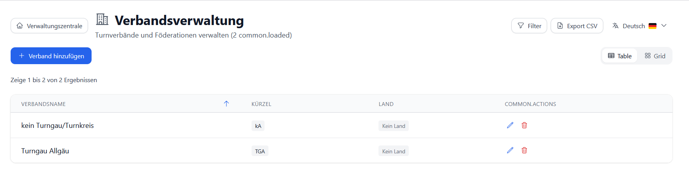
**Verbände-Verwaltung**
- Liste aller Verbände
- Detaillierte Verbandsinformationen
- Kontaktverwaltung

### Vereine & Personen

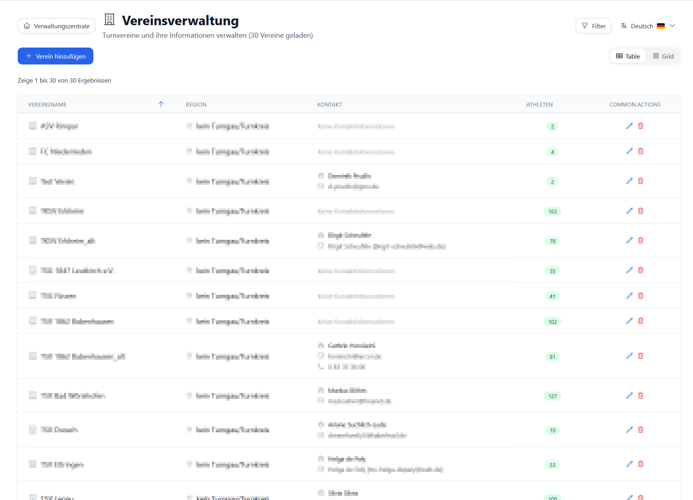
**Vereinsverwaltung**
- Umfassende Vereinsdatenbank
- Adressverwaltung
- Kontaktpersonen
- Statistiken pro Verein
- Export-Funktionen

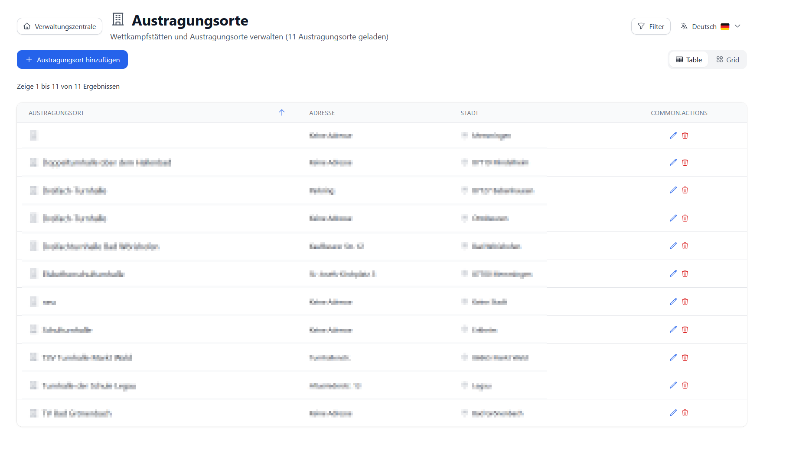
**Wettkampforte/Standorte**
- Verwaltung von Veranstaltungsorten
- Adressdaten und Kontaktinformationen
- Zuordnung zu Events

---

## 👤 Teilnehmer & Athleten

### Athleten-Datenbank

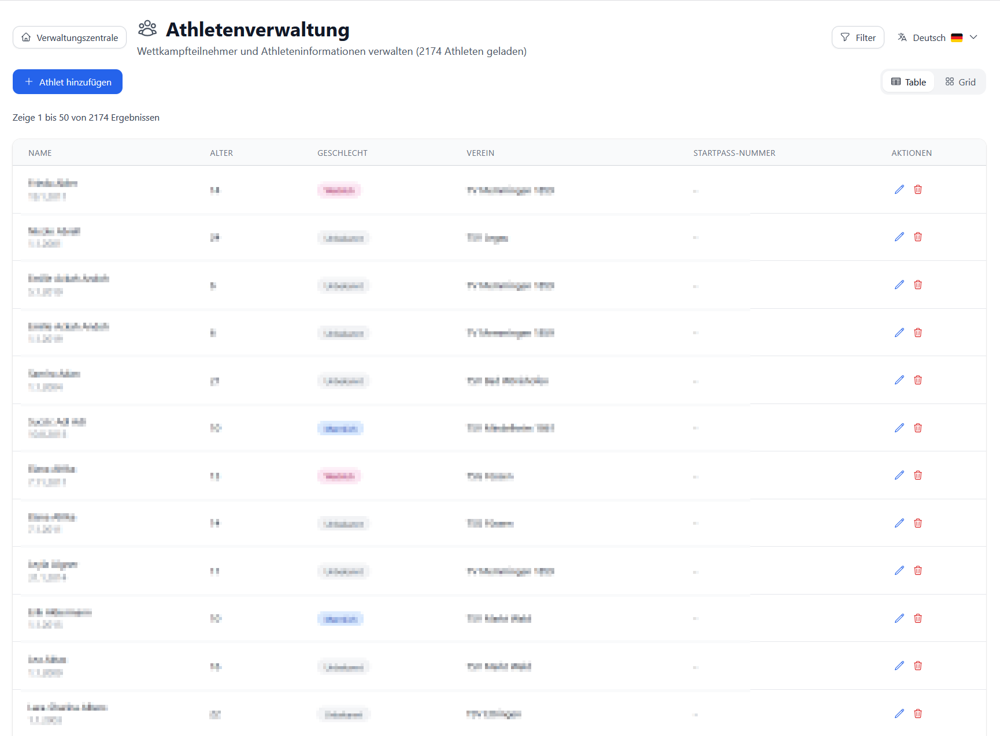
**Athleten-Verwaltung**
- Zentrale Athleten-Datenbank
- Geburtsdaten, Geschlecht
- Vereinszuordnung
- Suchfunktion mit Filtern
- Table/Card View Toggle

### Event-Teilnehmer

**Event-Teilnehmer**
- Event-spezifische Teilnehmerliste
- Startnummern-Verwaltung
- Riegen-Zuordnung
- Wettkampf-Zuordnungen
- Massenoperationen

**Teilnehmer-Details bearbeiten**
- Detailansicht einzelner Teilnehmer
- Wettkampf-Zuordnung
- Startnummer
- Status-Verwaltung
- Außer-Konkurrenz-Kennzeichnung

**Teilnehmer-Etiketten**
- PDF-Generierung für Namensschilder
- Sortierung nach Gender/Riege/Verein
- Druckbare Etiketten-Vorlagen
- Konfigurierbare Layouts

---

## 🏆 Wettkampf-Verwaltung

### Veranstaltungen

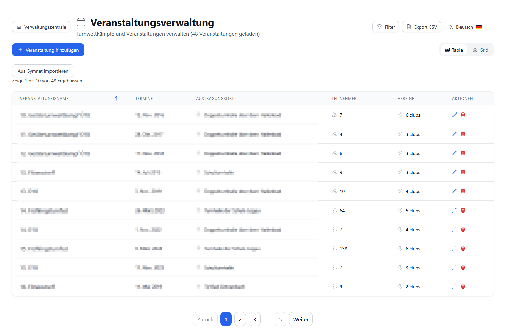
**Veranstaltungsverwaltung**
- Übersicht aller Events
- Event-Status tracking
- Veranstaltungsorte
- Zeiträume
- Schnellzugriff auf Event-Funktionen

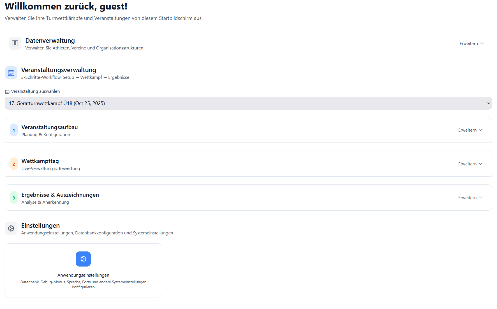
**Management Center**
- Event-Auswahl
- Zentrale Steuerung
- Navigation zu Event-Funktionen
- Event-Context für alle Operationen

### Wettkämpfe

**Wettkampf-Übersicht**
- Alle Wettkämpfe eines Events
- Altersgruppen
- Disziplinen
- Teilnehmerzahlen
- Status-Übersicht

**Wettkampf-Editor**
- Detaillierte Wettkampf-Konfiguration
- Disziplinen-Auswahl
- Altersgruppen-Definition
- Geschlechter-Zuordnung
- Formel-Konfiguration

### Riegen

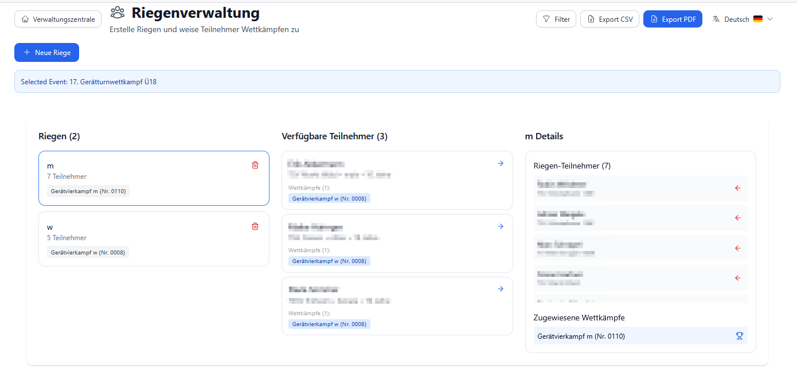
**Riegen-Management**
- Riegen-Übersicht
- Wettkampf-Zuordnung
- Teilnehmer pro Riege
- Drag & Drop Zuordnung
- Automatische Riegen-Generierung

---

## 📋 Disziplinen & Konfiguration

### Disziplinen

**Disziplinen-Verwaltung**
- Alle Disziplinen/Geräte
- Icons für Geräte
- Geschlechter-Zuordnung (m/w/beide)
- Kategorie-Zuordnung
- Feldkonfiguration

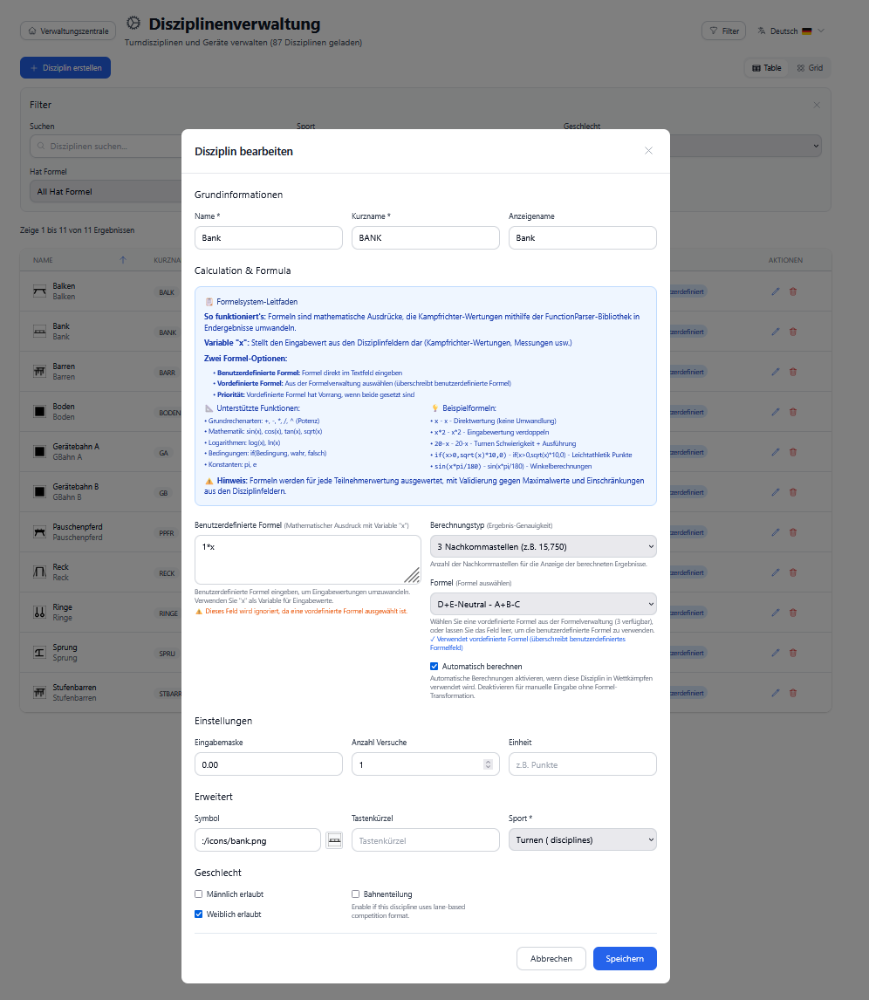
**Disziplin-Editor**
- Detaillierte Disziplin-Konfiguration
- Feld-Zuordnung (A-Note, B-Note, etc.)
- Formel-Definition
- Icon-Auswahl
- Geschlechter-Einstellungen

---

## 🎖️ Urkunden & Layouts

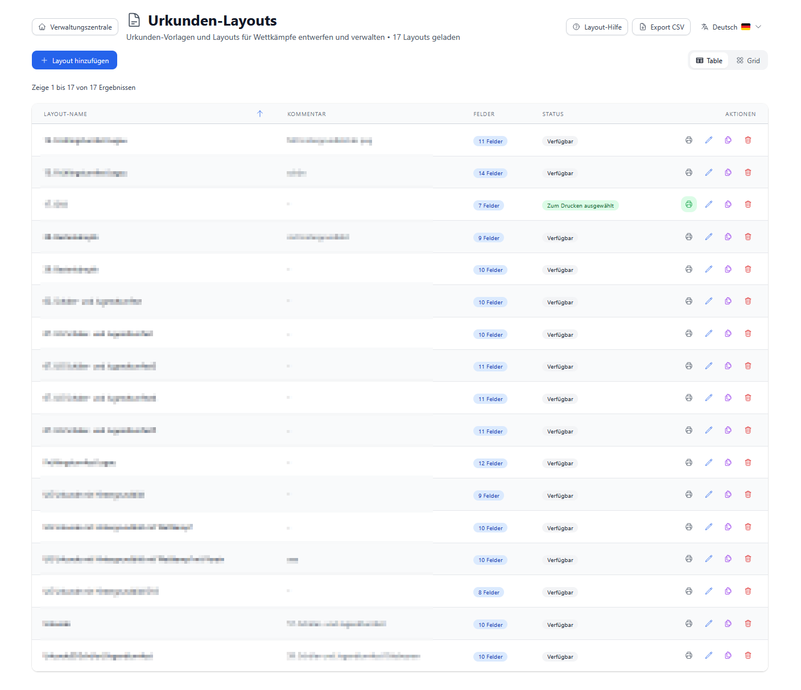
**Urkunden-Layout-Verwaltung**
- Vordefinierte Layouts
- Layout-Vorschau
- Layout-Auswahl pro Event
- Bearbeitung

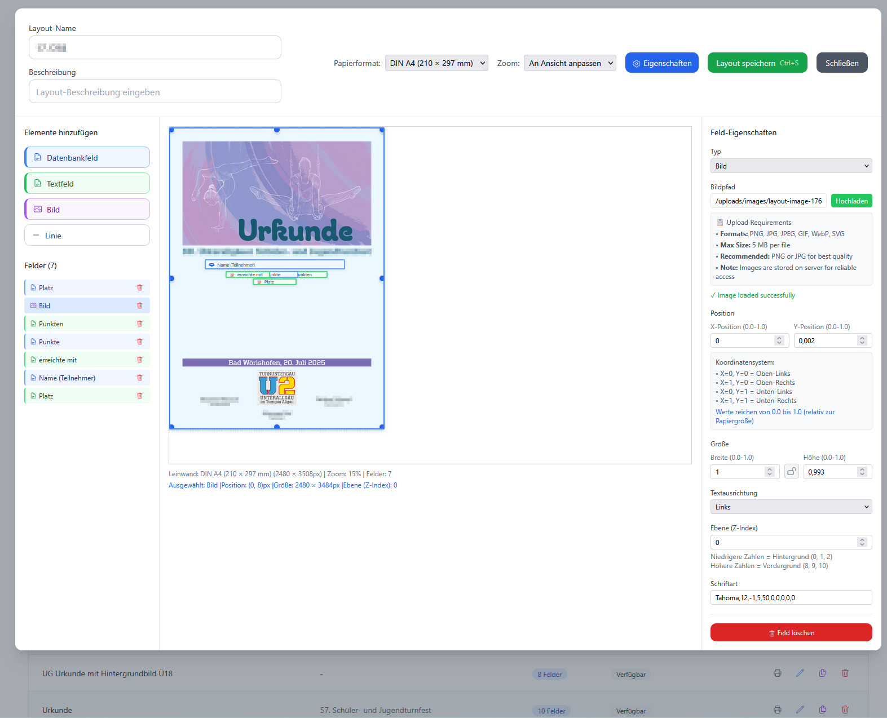
**Layout-Designer**
- Visual Layout-Editor
- Feld-Zuordnung
- Textblöcke positionieren
- Schriftarten & Größen
- Vorschau-Funktion

---

## 📊 Wertungserfassung & Ergebnisse

### Score Capture

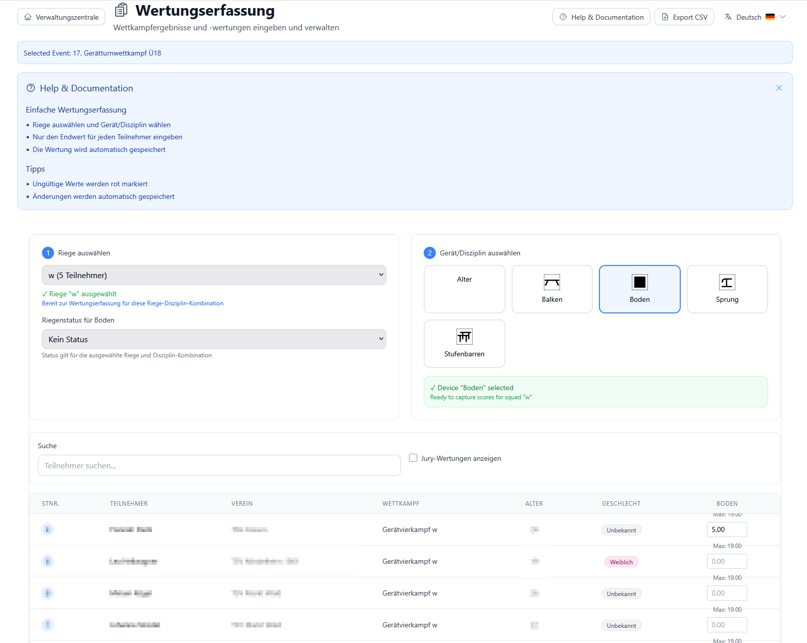
**Score Capture - Hauptansicht**
- Dynamisches Scoring-System
- Generische Formel-Engine
- Automatische Berechnungen
- Live-Updates
- Filter nach Riege/Wettkampf/Gerät

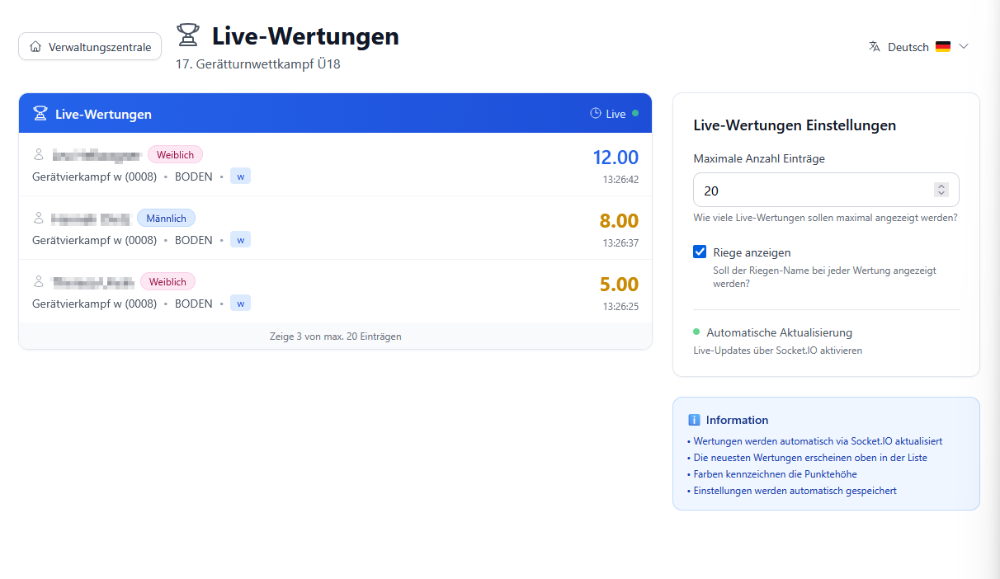
**Live-Scoring Ansicht**
- Echtzeit-Wertungsanzeige
- Aktueller Stand
- Rangliste
- Socket.IO Live-Updates

### Ergebnisse

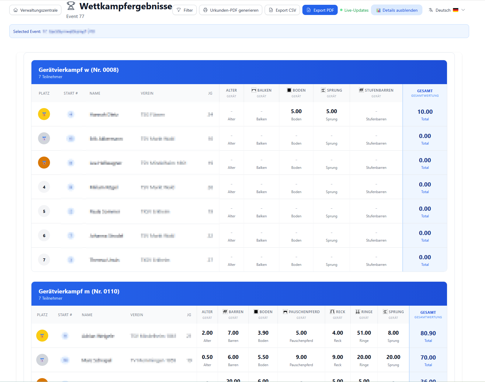
**Ergebnis-Übersicht**
- Vollständige Ergebnislisten
- Ranglisten
- Gesamt- und Einzelwertungen
- Export-Funktionen
- Filterung nach Wettkampf/Riege

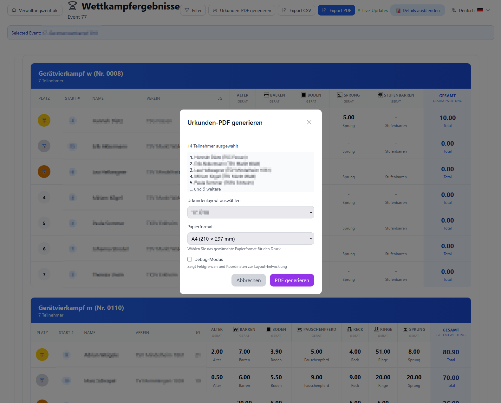
**Urkunden-Druck**
- PDF-Generierung
- Layout-Auswahl
- Batch-Druck
- Vorschau
- Filter nach Platzierung

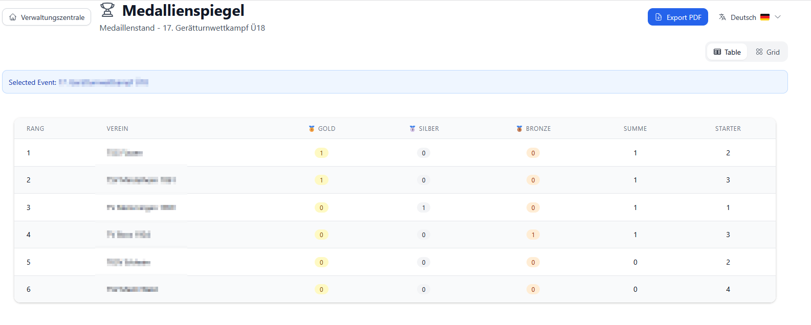
**Medaillenspiegel**
- Vereinswertung
- Gold/Silber/Bronze Zählung
- Gesamtübersicht
- Sortierung
- Export-Möglichkeit

---

## ⚖️ Kampfrichter-Portal (Jury Portal)

### Hauptansicht

**Jury Portal - Landing Page**
- Wettkampf-Auswahl
- Riegen-Auswahl
- Geräte-Navigation
- Eigenständiges Interface

### Wertungseingabe

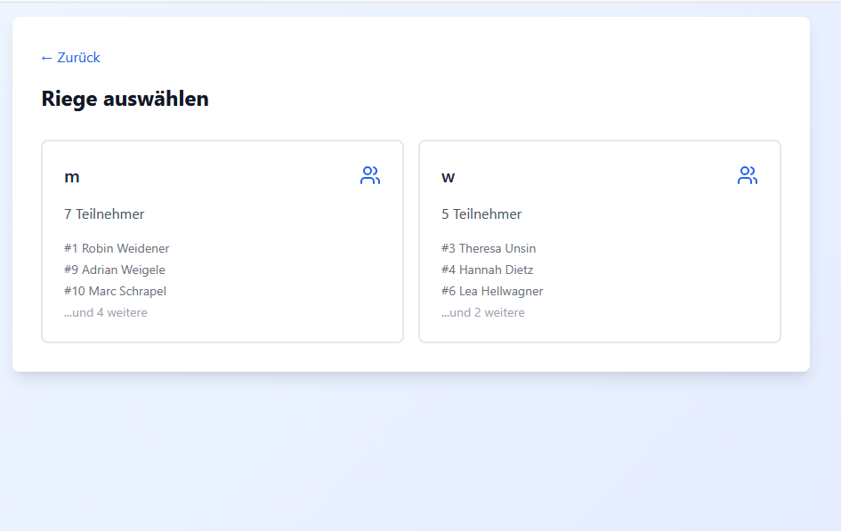
**Gerät-Auswahl**
- Visuelle Geräte-Icons
- Schnellzugriff
- Farbcodierung

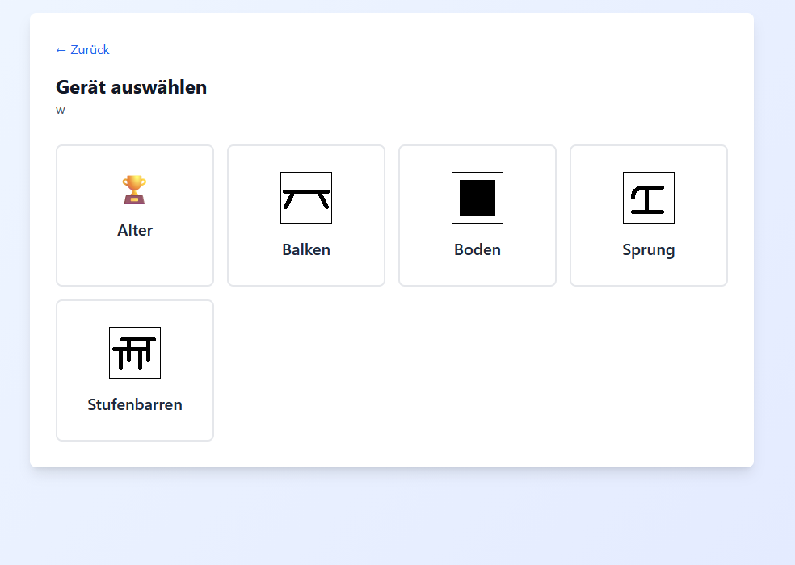
**Teilnehmer-Übersicht**
- Alle Turner der Riege
- Startnummern
- Wertungs-Status
- Schnellnavigation

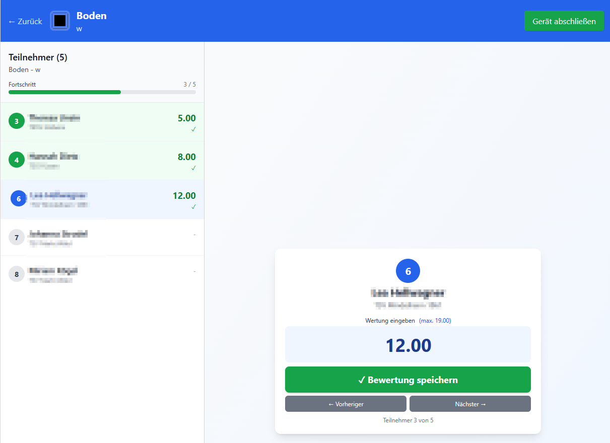
**Wertungs-Erfassung**
- Gerätespezifische Felder
- Dynamische Formular-Generierung
- Automatische Berechnungen
- Speichern-Funktion
- Validierung

---

## 🎯 Feature-Highlights

### Einheitliches UI-Design
- ✅ **Unified Header System** - Konsistente Navigation
- ✅ **Table/Card View Toggle** - Flexible Daten-Ansicht
- ✅ **Responsive Design** - Mobile-freundlich
- ✅ **Dark Mode Ready** - Moderne Oberfläche

### Lokalisierung
- ✅ **Deutsch & Englisch** - Vollständige Übersetzung
- ✅ **Gender-Unification** - Einheitliche Darstellung (m/w/gemischt)
- ✅ **Format-Konsistenz** - Datum, Zeit, Zahlen

### Export & Druck
- ✅ **PDF-Generation** - Urkunden, Reports, Etiketten
- ✅ **CSV-Export** - Alle Stammdaten
- ✅ **Batch-Operations** - Massenexport

### Real-time Features
- ✅ **Socket.IO** - Live-Updates
- ✅ **Live Scoring** - Echtzeit-Synchronisation
- ✅ **Multi-User** - Gleichzeitige Nutzung

### Daten-Management
- ✅ **CRUD-Complete** - Alle Entitäten verwaltbar
- ✅ **Search & Filter** - Erweiterte Suchfunktionen
- ✅ **Pagination** - Performance-optimiert
- ✅ **Validation** - Umfassende Validierung

---

## 🔄 Von Legacy zu Modern

Diese Screenshots zeigen den Fortschritt vom alten Qt/C++-Desktop zu einer modernen Webanwendung:

### Verbesserungen
- **Zugänglichkeit**: Browser statt Desktop-Installation
- **Multi-Device**: PC, Tablet, Smartphone
- **Kollaboration**: Mehrere Nutzer gleichzeitig
- **Updates**: Automatische Updates ohne Neuinstallation
- **Plattformunabhängig**: Windows, Mac, Linux

### Legacy-Kompatibilität
- **Datenbank**: Gleiche PostgreSQL-DB
- **Alt + Neu**: Beide Versionen parallel nutzbar
- **Migration**: Nahtloser Übergang

---

## 📖 Weitere Informationen

Für detaillierte Anleitungen siehe:
- [Benutzerhandbuch](../user-guide/README.md)
- [Entwicklerhandbuch](../developer-guide/README.md)
- [Deployment Guide](../deployment/production.md)

---

**Letzte Aktualisierung**: 5. November 2025  
**Screenshots**: 26 Bilder  
**Version**: TurnFix v2.0
